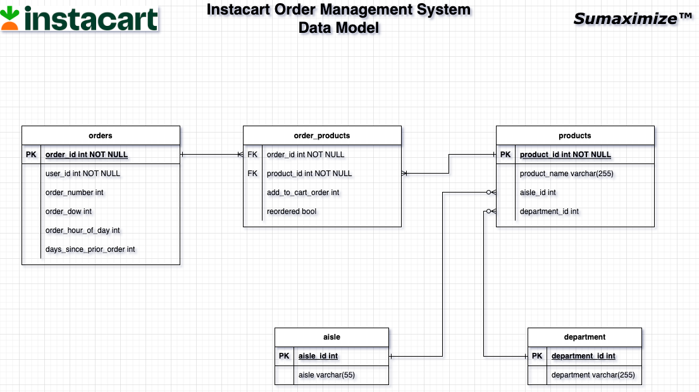

# Instacart's Order Management Data Model

Objective: to design a data model for Instacart's (American retail company) order management system.

**Data Model Design**

**Tables:**

1. _aisles_: details on where product is shelved in store eg. "breakfast bakery", "fresh vegetables", "refrigerated" etc
2. _departments_: product grouping eg. "frozen", "bakery", "produce", "pets" etc.
3. _order_products_: data which specifies if product has been reordered i.e if it was ordered in the past
4. _orders_: order details
5. _products_: product details

For detailed information on the data tables, please refer to [dataset source on Kaggle](https://www.kaggle.com/competitions/instacart-market-basket-analysis/data).

**Files**
- _instacart_data_model.sql_: code to create tables along with column constraints
- _instacart_order_management_data_model.ipynb_: code to create tables with constraints and to bulk upload the flat file data to the database tables

**NB**: we have used the opensource _Postgresql_ as our choice of database.